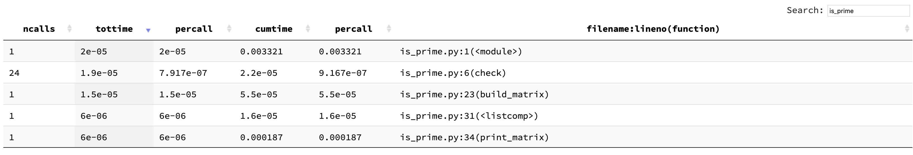
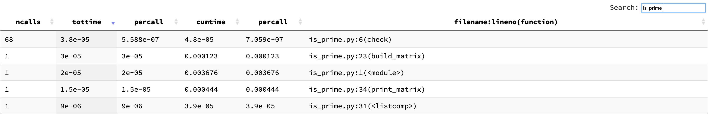
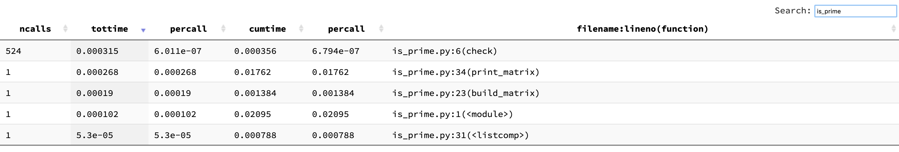
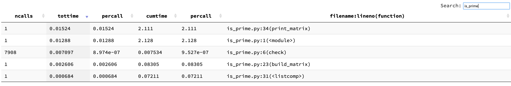

## Requirements
- Run from the command line
    - Default:
        - No user input
        - Calculate first 10 prime numbers
- Print Matrix of prime Numbers and their product
    - Indices Row(r) and Col(c) are the prime numbers
    - Products of `r*c` populate matrix

## Running the Code
- This project was developed using Python 3.7.1 but any version of Python3 _should_ work
- Install required packages
    - `pip install -r requirements.txt`
- Run the program from the command line with optional args
    - Navigate to the project's root directory
    - By default the program will build a multiplication table with the first 10 prime numbers
        - `python src/is_prime.py`
    - Using optional arg to generate a multiplication table with the first `N` prime number
        - `python src/is_prime.py --primes 20`
    - Show help message for the program
        - `python src/is_prime.py -h`

## Running the Tests
- From the root directory of the project run the tests using *Pytest*
    - `pytest -v`
- Pytest would have been installed from the _requirements.txt_ file see [Running the
  Code](#running-the-code)

## Performance Considerations
### Finding a large non prime number is fairly easy
```
from src.is_prime import check

timeit(check(sys.maxsize))
1.32 µs ± 11.2 ns per loop (mean ± std. dev. of 7 runs, 1000000 loops each)
```

### Verifying a large prime number is much more computationally expensive
Using the OpenSSL Command Line Tool we are able to generate prime numbers to work with
- `openssl prime -generate -bits 50`
```
timeit(check(987608350166551))
3.13 s ± 43.6 ms per loop (mean ± std. dev. of 7 runs, 1 loop each)
```

- `openssl prime -generate -bits 60`
```
timeit(check(964323014774268299))
1min 42s ± 1.3 s per loop (mean ± std. dev. of 7 runs, 1 loop each)
```

#### Profiling the Code
At first I expected the time complexity to be `O(n(log(n)))` after profiling it looks more like its
running at `O(n(log(n^2)))`

- Profile for first 10 primes



- Profile for first 20 primes



- Profile for first 100 primes




- Profile for first 1000 primes



#### Run the Profile Visualizer
To run the profiling tool I used for those screenshots you will need to download an extra tool
called [Snakeviz](https://jiffyclub.github.io/snakeviz/)
- Download the tool
    - `pip install snakeviz`
- Navigate to the profile directory
- Start the snakeviz server passing in one for the *cProfile* files
    - `snakeviz one_thousand_primes.prof`
    - Navigate to URL generated in the terminal
